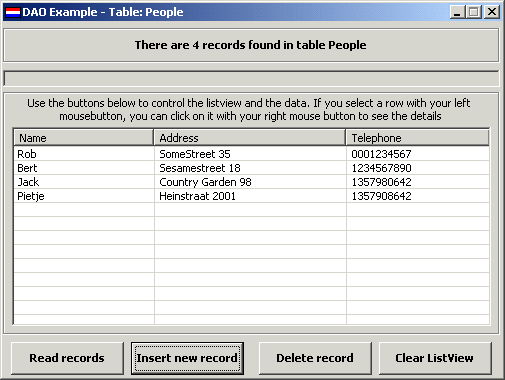



## DAO and ListView Example

### Description

With this application you can see how DAO works. You can completely control the database with this code, you learn how to read, insert and delete things from a database with no data controls or whatever :-) And also a great deal of the ListView control is used for this app. And it is completely documented and explained!!
 
### More Info
 
An Access 2000 database is used

             |
---                |---
**Submitted On**   |2001-10-09 01:48:12
**By**             |[Rob t\.H\.](https://github.com/Planet-Source-Code/PSCIndex/blob/master/ByAuthor/rob-t-h.md)
**Level**          |Beginner
**User Rating**    |4.8 (67 globes from 14 users)
**Compatibility**  |VB 4\.0 \(16\-bit\), VB 4\.0 \(32\-bit\), VB 5\.0, VB 6\.0, VB Script, VBA MS Access, VBA MS Excel
**Category**       |[Databases/ Data Access/ DAO/ ADO](https://github.com/Planet-Source-Code/PSCIndex/blob/master/ByCategory/databases-data-access-dao-ado__1-6.md)
**World**          |[Visual Basic](https://github.com/Planet-Source-Code/PSCIndex/blob/master/ByWorld/visual-basic.md)
**Archive File**   |[DAO and Li280151082001\.zip](https://github.com/Planet-Source-Code/rob-t-h-dao-and-listview-example__1-27926/archive/master.zip)

